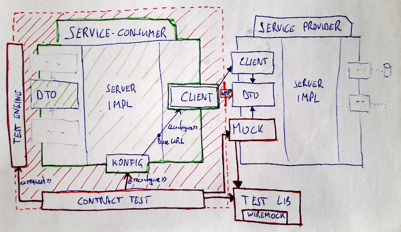

# contract-test-poc

How a possible contract test setup could look like.

## Tech stack

* Kotlin
* Ktor - Web server
* Kodein - Dependency injection
* Jackson - JSON serialization
* WireMock - Fake HTTP server
* TestNG - Test framework
* AssertK - Matcher library
* Versions Plugin - Run `./gradlew dependencyUpdates`

## Architecture

* Modules:
    * `test-lib`: mainly WireMock API wrapper
    * `service-provider`: provides products
        * `service-impl`: the actual Ktor server
        * `contract-dto`: transfer objects
        * `contract-client`: reusable HTTP requests
        * `contract-mock`: reusable test definition, using test-lib
    * `service-consumer`: consumes/filters products and returns bestsellers
        * `service-impl`: the actual Ktor server , using service-provider's client
        * `contract-client`: reusable HTTP requests, used by own contract tests
        * `contract-dto`: transfer objects
        * ... could also have mock ...
* [ContractTest.kt](https://github.com/christophpickl/contract-test-poc/blob/master/service-consumer/server-impl/src/test/kotlin/cpickl/contracttest/serviceconsumer/serverimpl/ContractTest.kt) for `service-consumer`:
    1. Starting up local WireMock server
    1. Test fully controlls test application engine startup (beans, configuration)
    1. Reusing `service-provider`'s stub definition; see [provider_mock.kt](https://github.com/christophpickl/contract-test-poc/blob/master/service-provider/contract-mock/src/main/kotlin/cpickl/contracttest/serviceprovider/contractmock/provider_mock.kt)
    1. Request own endpoint (using Ktor's test application engine)
    1. Compare with `contract-dto` definition
    1. Verify WireMock stub

## Possible doings

* Mock failing responses
* More complex HTTP requests
* Generate contract classes by a custom OpenAPI generator
* Database access
* Startup a real Ktor application engine, and run tests for contract-client
